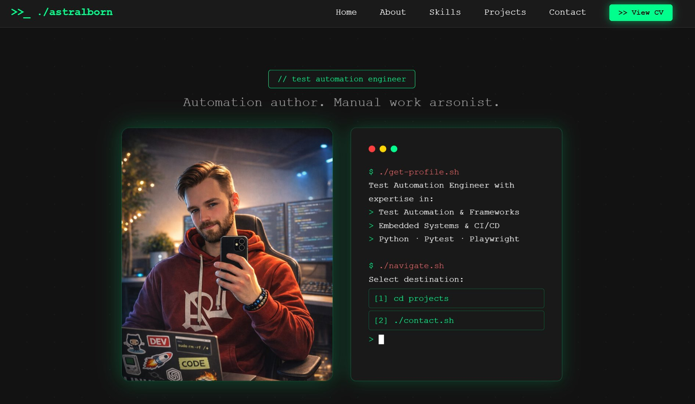

<div align="center">

Personal portfolio — terminal-inspired, cyberpunk aesthetic, zero dependencies.

<br>

<a href="https://astralborn.github.io">
  
</a>

</div>

---

[](https://astralborn.github.io)

---

## Features

- **Terminal boot screen** — animated startup sequence on first load, skippable on click or keypress
- **Scroll reveal animations** — sections and cards fade in as they enter the viewport via `IntersectionObserver`
- **Active nav highlight** — current section tracked on scroll, underline indicator transitions smoothly
- **Clipboard copy buttons** — one-click copy for email, GitHub, and LinkedIn in the contact section
- **Responsive layout** — mobile hamburger nav, stacked grids, touch-friendly
- **SVG favicon** — terminal cursor icon, no `.ico` toolchain needed
- **Branded 404 page** — fake pytest failure screen, links back home, GitHub Pages auto-serves it
- **Open Graph / Twitter card meta** — rich link preview when shared on LinkedIn, Slack, iMessage
- **Dynamic copyright year** — never manually update it again
- **Zero runtime dependencies** — no React, no Vue, no framework

---

## Structure

```
.
├── index.html              # Single page
├── 404.html                # Custom GitHub Pages error page
├── pytest.ini              # Pytest config — sets pythonpath and testpaths
├── requirements-test.txt   # Test dependencies (playwright, pytest, pytest-playwright)
└── src/
    ├── css/
    │   ├── main.css        # Base styles, layout, boot screen, components
    │   ├── components.css  # Nav, hero grid, skills terminal, project cards
    │   └── animations.css  # Keyframe definitions
    ├── js/
    │   └── main.js         # Boot screen, scroll observers, copy buttons, nav
    └── assets/
        ├── CV_astralborn.pdf
        └── images/
            ├── photo.png
            └── mockup.png
└── tests/
    ├── conftest.py                  # Shared fixtures (portfolio_local, portfolio_local_ready)
    ├── test_boot_screen.py          # Boot screen overlay (15 tests)
    ├── test_navbar.py               # Navigation bar & active-scroll (21 tests)
    ├── test_hero.py                 # Hero section content & links (23 tests)
    ├── test_about.py                # About section & code window (22 tests)
    ├── test_skills.py               # Skills terminal & proficiency labels (29 tests)
    ├── test_projects.py             # Projects grid & GitHub links (28 tests)
    ├── test_contact.py              # Contact terminal, links & copy buttons (27 tests)
    ├── test_page_meta.py            # <head> meta, footer & 404 page (21 tests)
    ├── test_animations.py           # Scroll-reveal & IntersectionObserver (28 tests)
    └── pages/                       # Page Object Model
        ├── portfolio_page.py        # Top-level facade
        ├── boot_screen_page.py
        ├── navbar_page.py
        ├── hero_section_page.py
        ├── about_section_page.py
        ├── skills_section_page.py
        ├── projects_section_page.py
        └── contact_section_page.py
```

---

## Tests

The project is covered by an end-to-end Playwright test suite written in Python.  
Tests run against the local `index.html` — no live network required.

### Stack


### Setup

```bash
pip install -r requirements-test.txt
playwright install chromium
```

### Run

```bash
# All tests (headless, local file)
pytest

# Headed mode — watch the browser
pytest --headed

# Specific file
pytest tests/test_navbar.py

# Verbose output
pytest -v
```

### What's covered

| File | Area | Tests |
|---|---|---|
| `test_boot_screen.py` | Boot overlay: visibility, status lines, dismiss by click/key (Esc/Enter/Space), auto-dismiss | 15 |
| `test_navbar.py` | Logo, nav links, CV button, security attrs, click-scroll, scroll-spy accuracy | 21 |
| `test_hero.py` | Tag, subtitle, photo, terminal commands, cursor, link hrefs, click-scroll | 23 |
| `test_about.py` | Heading, intro copy, stat items, code window content | 22 |
| `test_skills.py` | 8 skill rows, 2 categories, proficiency labels, bar blocks | 29 |
| `test_projects.py` | 3 cards, GitHub slugs, tag lists, descriptions, new-tab popup | 28 |
| `test_contact.py` | Links, schemes, copy buttons, terminal lines, clipboard, new-tab popup | 27 |
| `test_page_meta.py` | Title, OG/Twitter meta, lang, charset, footer, 404 page | 21 |
| `test_animations.py` | .lazy-section class, .visible class, opacity=1, translateY=0 per section & fade-in element | 28 |


---

## Tech


---

## Deployment

Hosted on **GitHub Pages** from the `main` branch root. The custom 404 page is picked up by GitHub Pages without any extra config.

---

*Built with vanilla JS and the audacity to not use React.*

---